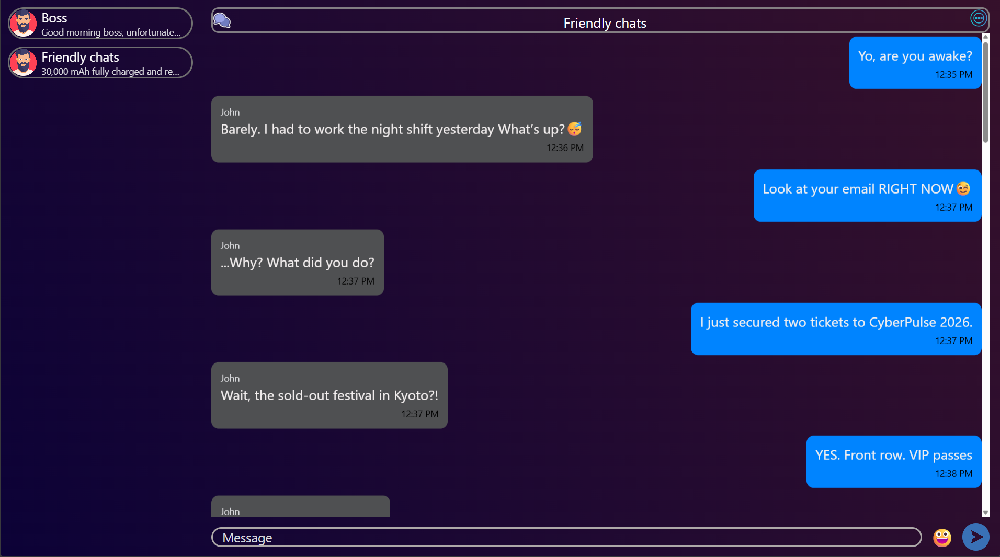
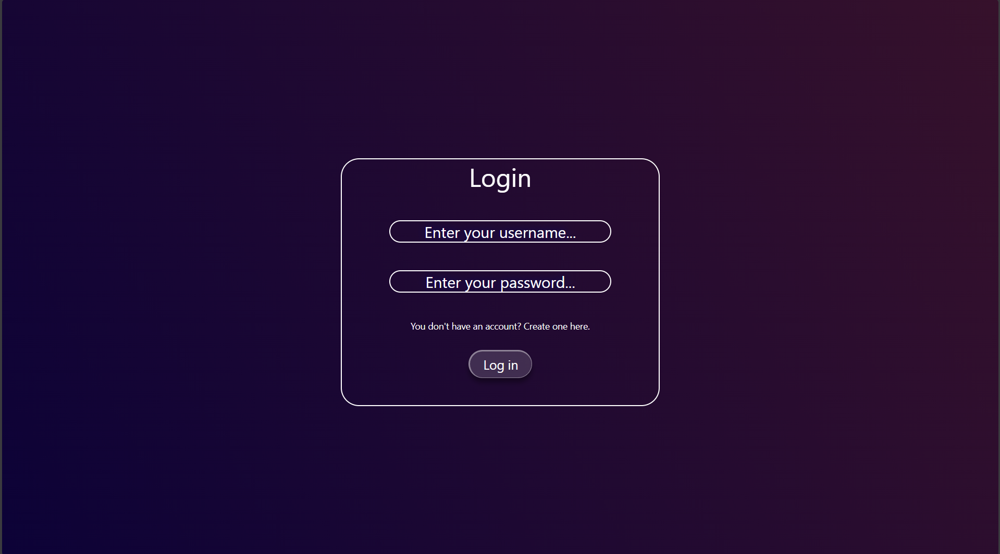
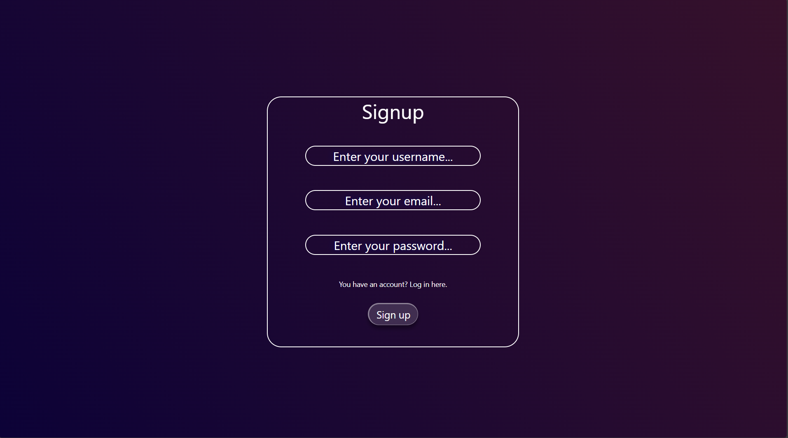
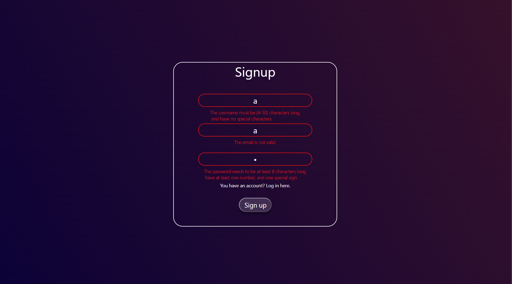
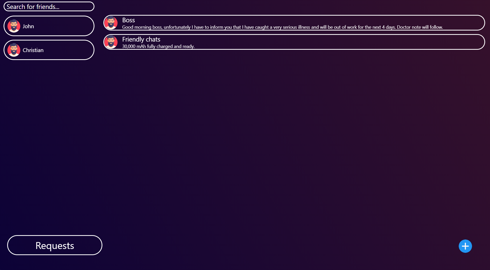

# Real-Time Event-Driven Chat App

A full-stack messaging application built with **Java 21**, **Spring Boot**, **Apache Kafka**, and **React Native (Expo)**.

---

## Tech Stack

### Backend
* **Core:** Java 21, Spring Boot 4.1.0, Maven
* **Database & Persistence:** PostgreSQL, Spring Data JPA / Hibernate
* **Messaging & Streaming:** Apache Kafka, Zookeeper, Spring Kafka
* **Real-Time Communication:** Spring WebSocket (STOMP)
* **Security:** Spring Security, JWT (JSON Web Tokens)
* **DevOps:** Docker, Docker Compose

### Frontend
* **Core:** React Native (Expo SDK), Expo Router, TypeScript
* **Networking:** Axios (REST), STOMP over WebSockets
* **UI:** Expo Linear Gradient, StyleSheet, Dynamic Theme Support (Dark/Light mode)

---

## How It Works & Key Decisions

### 1. Asynchronous Messaging Pipeline
* **Decoupled Event Streaming:** Incoming HTTP/WebSocket messages are immediately pushed to Kafka topics.
  This offloads database writes from WebSocket threads, preventing bottlenecks and keeping client connections responsive under load.
* **Low-Latency Updates:** STOMP over WebSockets handles two-way message delivery to both web and mobile clients in real time.

### 2. Database Design & Optimization
* **Relational Schema:** Built on PostgreSQL with explicit indexing, foreign key constraints, composite keys, and cascading rules.
* **Efficient Pagination (`Slice<T>`):** Chat history uses Spring Data's `Slice<T>` instead of standard `Page<T>`.
  This avoids running unnecessary `COUNT(*)` queries on every scroll, making historical message fetching in React Native’s inverted `FlatList` significantly faster.

### 3. Security
* **Stateless REST Security:** Endpoints are protected via Spring Security filter chains using JWT bearer tokens.
* **Secured WebSockets:** Connection handshakes and STOMP subscriptions validate JWT tokens directly from authorization headers before establishing a live session.

### 4. Security & End-to-End Encryption (E2EE)

This application incorporates full **End-to-End Encryption (E2EE)** to ensure user privacy.
Message contents are encrypted locally on the sender's device and can only be decrypted by the intended recipients.
The server stores only encrypted payloads and has zero knowledge of private keys or plaintext content.

#### How It Works

1. **Key Generation & Local Storage:**
   - Upon initialization, unique cryptographic key pairs (public and private keys) are generated.
   - The private key is stored securely on the local device SecureStore / LocalStorage and never leaves the client.

2. **Message Encryption & Key Exchange:**
   - Chat messages are encrypted using a unique symmetric chat session key and an Initialization Vector.
   - The symmetric chat key is independently encrypted for each participant using **ECDH** (Elliptic-curve Diffie-Hellman) key exchange.

3. **Client-side Decryption:**
   - When fetching chats, the client tests packets in  using its local private key.
   - Once the matching chat key is decrypted, the application decrypts messages on-the-fly before rendering it in the UI.

## Screenshots from the application

